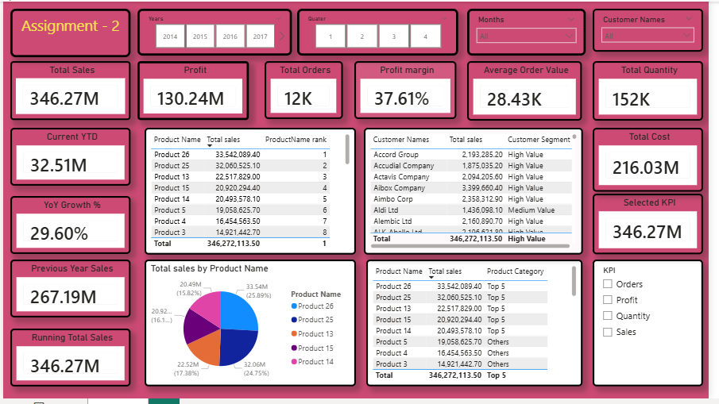

# 📊 Sales Performance Dashboard (Power BI)

## 📌 Overview

This project is an interactive Power BI dashboard designed to analyze sales performance, profitability, customer behavior, and product performance using business intelligence techniques.

---

## 🎯 Business Objective

The objective of this dashboard is to help business stakeholders monitor sales performance and make data-driven decisions by analyzing:

- Sales
- Profit
- Orders
- Profit Margin
- Customer Segments
- Product Performance

---

## 🛠 Tools Used

- Power BI
- Power Query
- DAX
- Data Modeling

---

## 📈 Dashboard Features

- KPI Cards
- Year, Quarter & Month Filters
- Customer Filter
- Product Ranking
- Customer Segmentation
- Product-wise Sales Analysis
- Sales Distribution Chart

---

## 📊 Key KPIs

| KPI | Value |
|------|-------|
| Total Sales | 346.27M |
| Profit | 130.24M |
| Total Orders | 12K |
| Profit Margin | 37.61% |
| Average Order Value | 28.43K |
| Total Quantity | 152K |

---

## 🖼 Dashboard Preview

---

## 📂 Project Files

- Assignment 2- Ashish.pbix
- dashboard_screenshot.png
- README.md

---

## 🚀 Author

**Ashish Kumar**

Data Analyst | Power BI | SQL | Python | Excel
